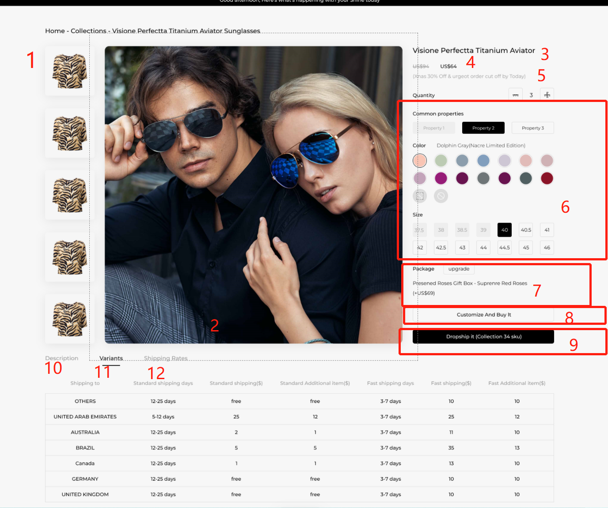
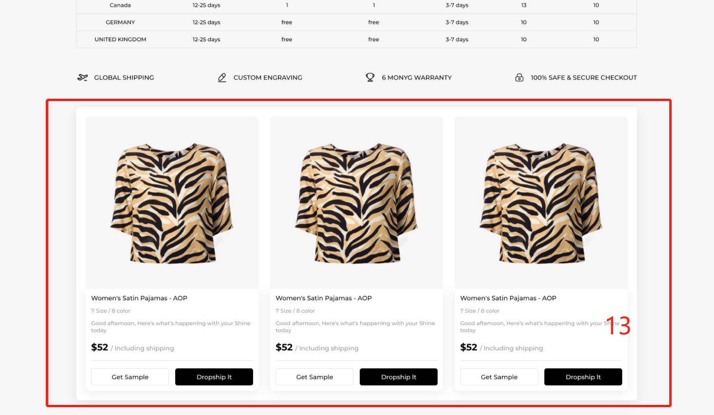

# 白板详情



```azure
白板详情接口
https://shineapi.xiaoyuanchao.xyz/doc.html#/v1/%E7%99%BD%E6%9D%BF/blankProductDetail
1、图片列表
    showImageList
2、当前选中的图片的大图
3、产品标题
    blankProductInfo.model
4、产品价格和优惠价格
    优惠价格：favorablePrice
    价格：price
5、产品描述
    blankContent
6、产品属性信息
    option1:属性1
    option2:属性2
    option3:属性3
7、产品配件信息
    level1Fittings：级别1配件
    level2Fittings：级别2配件
    level3Fittings：级别3配件
8、定制和购买
    这个按钮的功能要根据blankProductInfo.customizable的值来判断；如果是true，则表示可以定制，如果是false,则不需要定制就能购买
9、分销
    这个按钮的功能要根据blankProductInfo.dropshiped的值来判断；如果是true，则表示已经分销过了，点击后跳去分销；如果是false，则可以取消分销
10、产品描述
    blankDescToC
11、变体列表
    skuList
12、运输价格列表
    shippingRateInfos
13、推荐产品列表
    https://shineapi.xiaoyuanchao.xyz/doc.html#/v1/%E7%99%BD%E6%9D%BF/blankProductPage
    需要传这个入参：recommendFromProductId，值为当前页面的白板ID
```


