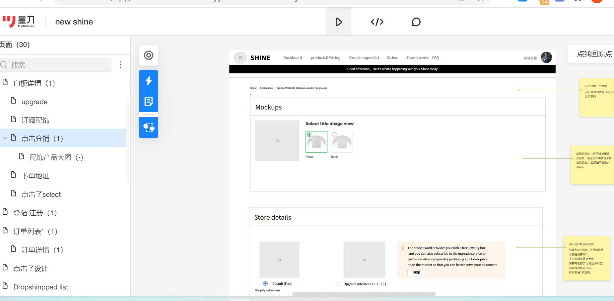
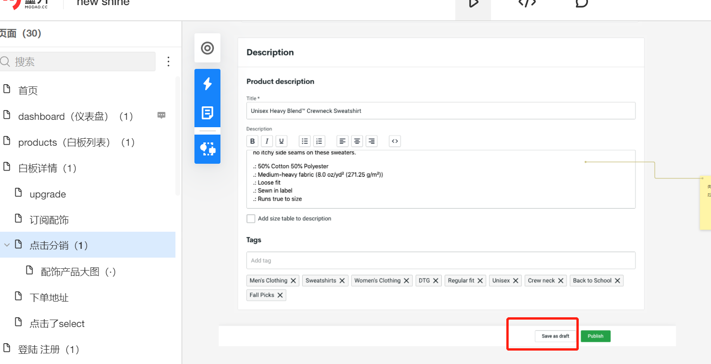
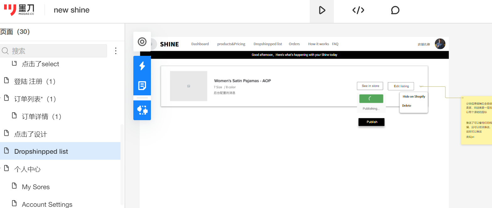

# 分销
## 白板判断是否已经分销
```html
白板列表和白板详情的返回信息都有dropshiped(是否已经分销过)
如果这个值为true,则表示已经分销了，则界面上面的分销按钮，已经变成取消分销
https://shineapi.xiaoyuanchao.xyz/doc.html#/v1/%E5%88%86%E9%94%80/cancelCustomProduct
如果这个值为false，则表示没有分销，点击就跳转到分销详情
https://shineapi.xiaoyuanchao.xyz/doc.html#/v1/%E5%88%86%E9%94%80/detail
```

## 分销详情(如果没有分销，则会自动创建)

```azure
https://shineapi.xiaoyuanchao.xyz/doc.html#/v1/%E5%88%86%E9%94%80/detail
入参是白板ID，也就是白板列表或者白板详情中的ID
```

## 添加/修改分销

```azure
https://shineapi.xiaoyuanchao.xyz/doc.html#/v1/%E5%88%86%E9%94%80/modify
save as draft 调用上面接口就行
publish :这个功能普通商店没有，要shopify店铺或者woocommerce店铺才有。这个功能也是先调用上面接口，然后再调用
推送的接口
https://shineapi.xiaoyuanchao.xyz/doc.html#/v1/%E5%88%86%E9%94%80/publishCustomProduct
上面接口返回发布ID，需要调用下面接口，轮询发布进度（3s轮询一次就行）
https://shineapi.xiaoyuanchao.xyz/doc.html#/v1/%E5%88%86%E9%94%80/getPublishStatus
```

## 分销列表(dropshipped list)


```azure
发布：
https://shineapi.xiaoyuanchao.xyz/doc.html#/v1/%E5%88%86%E9%94%80/publishCustomProduct
获取发布进度：
https://shineapi.xiaoyuanchao.xyz/doc.html#/v1/%E5%88%86%E9%94%80/getPublishStatus
hide on shopify/woocommerce:
https://shineapi.xiaoyuanchao.xyz/doc.html#/v1/%E5%88%86%E9%94%80/hideOnServer
show on shopify/woocommerce:
https://shineapi.xiaoyuanchao.xyz/doc.html#/v1/%E5%88%86%E9%94%80/showOnServer
删除(入参是分销ID):
https://shineapi.xiaoyuanchao.xyz/doc.html#/v1/%E5%88%86%E9%94%80/removeCustomProduct
批量删除:
https://shineapi.xiaoyuanchao.xyz/doc.html#/v1/%E5%88%86%E9%94%80/removeBatch
取消分销(入参是白板ID),白板详情或者白板分页使用:
https://shineapi.xiaoyuanchao.xyz/doc.html#/v1/%E5%88%86%E9%94%80/cancelCustomProduct
```
