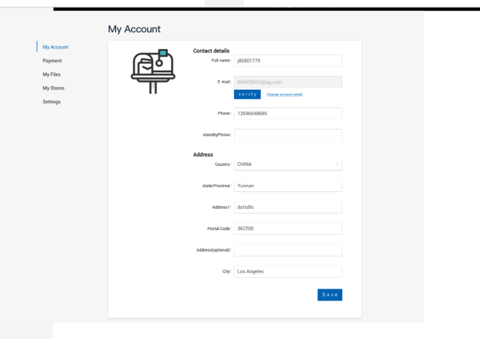
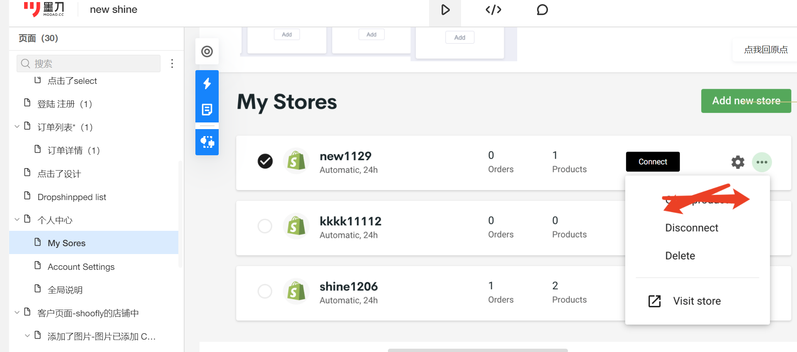
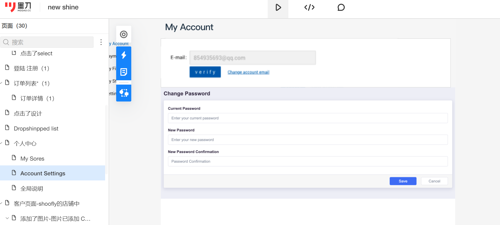

# 个人中心

## 我的账号


```azure
获取账号信息：
https://shineapi.xiaoyuanchao.xyz/doc.html#/v1/%E5%95%86%E6%88%B7%E6%8E%A5%E5%8F%A3/merchantInfo
修改账号信息：
https://shineapi.xiaoyuanchao.xyz/doc.html#/v1/%E5%95%86%E6%88%B7%E6%8E%A5%E5%8F%A3/editMerchantInfo
国家列表：
https://shineapi.xiaoyuanchao.xyz/doc.html#/v1/%E5%85%AC%E5%85%B1%E6%8E%A5%E5%8F%A3/countrys
省份列表：
https://shineapi.xiaoyuanchao.xyz/doc.html#/v1/%E5%85%AC%E5%85%B1%E6%8E%A5%E5%8F%A3/provinces
修改邮箱：
https://shineapi.xiaoyuanchao.xyz/doc.html#/v1/%E5%95%86%E6%88%B7%E6%8E%A5%E5%8F%A3/changeEmail
发送邮箱确认邮件：
https://shineapi.xiaoyuanchao.xyz/doc.html#/v1/%E5%95%86%E6%88%B7%E6%8E%A5%E5%8F%A3/sendConfirmEmail

```

## 我的店铺

```azure
店铺列表
https://shineapi.xiaoyuanchao.xyz/doc.html#/v1/%E5%BA%97%E9%93%BA%E6%8E%A5%E5%8F%A3/shopList
disconnect:
https://shineapi.xiaoyuanchao.xyz/doc.html#/v1/%E5%BA%97%E9%93%BA%E6%8E%A5%E5%8F%A3/disconnect
删除店铺：
https://shineapi.xiaoyuanchao.xyz/doc.html#/v1/%E5%BA%97%E9%93%BA%E6%8E%A5%E5%8F%A3/removeShop
获取shopify connect链接
https://shineapi.xiaoyuanchao.xyz/doc.html#/v1/%E5%BA%97%E9%93%BA%E6%8E%A5%E5%8F%A3/shopifyConnectUrlGet
获取woocommerce connect链接
https://shineapi.xiaoyuanchao.xyz/doc.html#/v1/%E5%BA%97%E9%93%BA%E6%8E%A5%E5%8F%A3/woocommerceConnectUrlGet
woocommerce connect状态获取(回调后调用，获取授权状态)
https://shineapi.xiaoyuanchao.xyz/doc.html#/v1/%E5%BA%97%E9%93%BA%E6%8E%A5%E5%8F%A3/woocommerceConnectStatus
切换当前店铺
https://shineapi.xiaoyuanchao.xyz/doc.html#/v1/%E5%BA%97%E9%93%BA%E6%8E%A5%E5%8F%A3/changeShop
设置店铺名称
https://shineapi.xiaoyuanchao.xyz/doc.html#/v1/%E5%BA%97%E9%93%BA%E6%8E%A5%E5%8F%A3/setShopName
```

## 账号设置(Account Settings)

```azure
修改邮箱：
https://shineapi.xiaoyuanchao.xyz/doc.html#/v1/%E5%95%86%E6%88%B7%E6%8E%A5%E5%8F%A3/changeEmail
发送邮箱确认邮件：
https://shineapi.xiaoyuanchao.xyz/doc.html#/v1/%E5%95%86%E6%88%B7%E6%8E%A5%E5%8F%A3/sendConfirmEmail
修改密码：
https://shineapi.xiaoyuanchao.xyz/doc.html#/v1/%E5%95%86%E6%88%B7%E6%8E%A5%E5%8F%A3/updatePasswd
```
