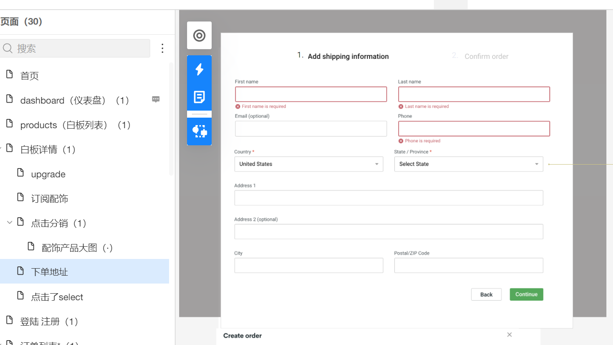
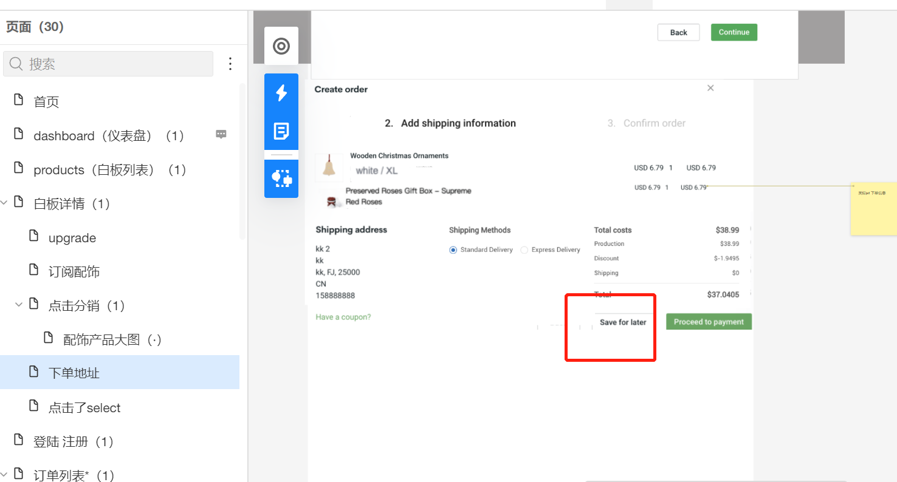
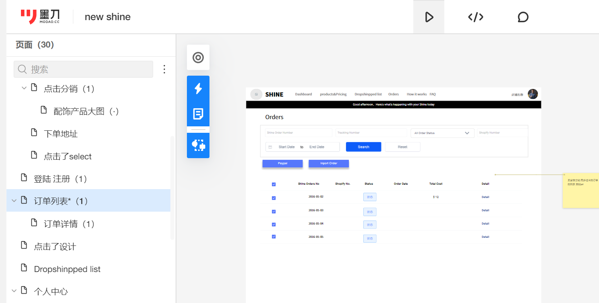

# 订单

```azure
用户填写完收货地址信息，先调用下面接口，获取价格、物流方式等信息
https://shineapi.xiaoyuanchao.xyz/doc.html#/v1/%E8%AE%A2%E5%8D%95/priceCalculate

```


```azure
创建订单:
https://shineapi.xiaoyuanchao.xyz/doc.html#/v1/%E8%AE%A2%E5%8D%95/create

save for later：直接调用创建订单接口，然后结束
process for payment:先调用创建订单接口，然后再调用支付接口
```



```azure
订单列表
https://shineapi.xiaoyuanchao.xyz/doc.html#/v1/%E8%AE%A2%E5%8D%95/orderPage

```


```azure
订单详情：
https://shineapi.xiaoyuanchao.xyz/doc.html#/v1/%E8%AE%A2%E5%8D%95/orderDetail
提交问题订单(on hold):
https://shineapi.xiaoyuanchao.xyz/doc.html#/v1/%E8%AE%A2%E5%8D%95/onHold
取消订单：
https://shineapi.xiaoyuanchao.xyz/doc.html#/v1/%E8%AE%A2%E5%8D%95/cancelOrder
订单重新价格计算（修改收货地址时候）：
https://shineapi.xiaoyuanchao.xyz/doc.html#/v1/%E8%AE%A2%E5%8D%95/priceCalculateByOrder
修改收货地址：
https://shineapi.xiaoyuanchao.xyz/doc.html#/v1/%E8%AE%A2%E5%8D%95/updateShipping
```
