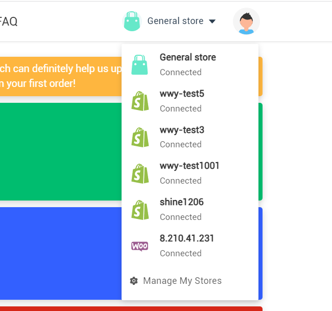
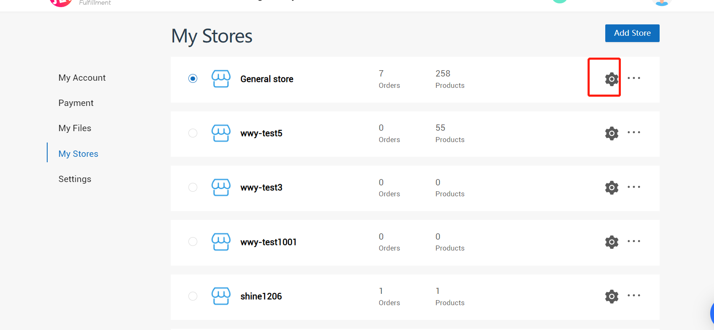
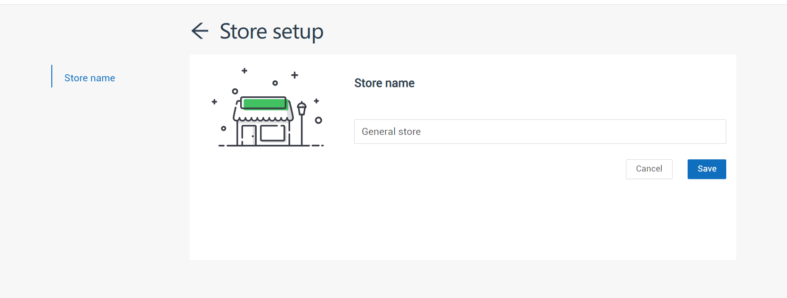
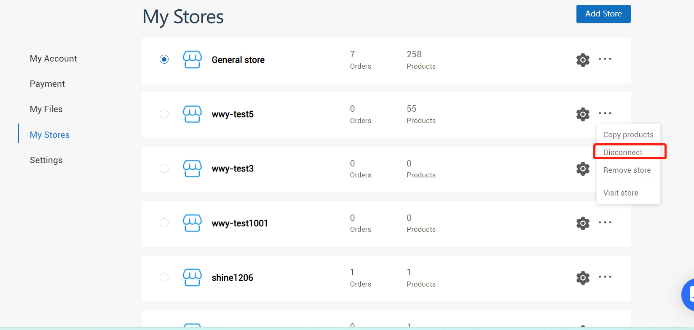
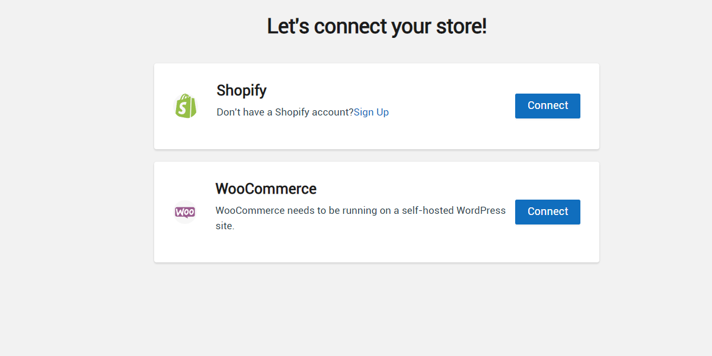
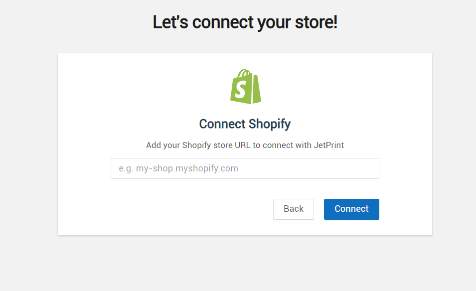

# 店铺

## 店铺列表
```azure
接口：
https://shineapi.xiaoyuanchao.xyz/doc.html#/v1/%E5%BA%97%E9%93%BA%E6%8E%A5%E5%8F%A3/shopList

```


## 切换当前店铺
```azure
切换店铺时候，要调用接口通知后台，而且要刷新当前页面；比如当前在订单中心，就要重新调用订单列表的接口，刷新切换到的店铺的订单

```
https://shineapi.xiaoyuanchao.xyz/doc.html#/v1/%E5%BA%97%E9%93%BA%E6%8E%A5%E5%8F%A3/changeShop

## 设置店铺名称
```azure
https://shineapi.xiaoyuanchao.xyz/doc.html#/v1/%E5%BA%97%E9%93%BA%E6%8E%A5%E5%8F%A3/setShopName
```



## 取消关联店铺
```azure
店铺现在分成两种类型，一种是general store(一般店铺)，这种店铺是不能删除，不能取消关联的。
另一种是shopify店铺，这种是可以删除，也可以取消关联的。
取消关联的意思就是把我们这儿的店铺跟第三方商城那儿的店铺取消掉关联关系。
https://shineapi.xiaoyuanchao.xyz/doc.html#/v1/%E5%BA%97%E9%93%BA%E6%8E%A5%E5%8F%A3/disconnect
```

## 删除店铺
```azure
一般店铺不能删除，其他的可以
https://shineapi.xiaoyuanchao.xyz/doc.html#/v1/%E5%BA%97%E9%93%BA%E6%8E%A5%E5%8F%A3/removeShop
```

## 关联店铺

### shopify店铺

#### 获取shopify店铺关联的跳转链接
```azure
用户输入他在shopify那儿店铺的域名，调用接口，就能获取关联需要的链接。前端跳转到这个链接
https://shineapi.xiaoyuanchao.xyz/doc.html#/v1/%E5%BA%97%E9%93%BA%E6%8E%A5%E5%8F%A3/shopifyConnectUrlGet
```


